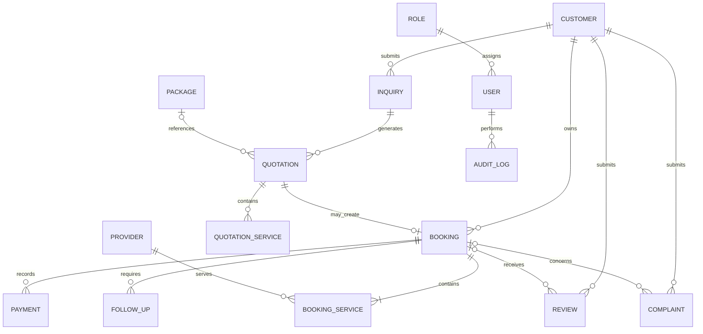

# AMX — Conceptual Data Model

**File:** `docs/database/conceptual-data-model.md`
**Phase:** 6 — Database & API Design
**Status:** Draft for Validation

## 1. Purpose

Define the main business entities, their relationships, and the information AMX must manage before designing the detailed database schema.

## 2. Core Entities

| Entity            | Purpose                                                            |
| ----------------- | ------------------------------------------------------------------ |
| Customer          | Stores customer contact information and history.                   |
| Inquiry           | Records a customer's trip request.                                 |
| Provider          | Stores guides, drivers, hotels, boat services, and tour operators. |
| Package           | Defines AMX's available tourism experiences.                       |
| Quotation         | Records proposed services, prices, and terms.                      |
| Quotation Service | Lists services included in a quotation.                            |
| Booking           | Records a customer's confirmed trip arrangement.                   |
| Booking Service   | Records individual services and their assigned providers.          |
| Payment           | Records and tracks external customer payments.                     |
| Follow-Up         | Tracks customer and operational follow-up tasks.                   |
| Review            | Records customer feedback after completed trips.                   |
| Complaint         | Tracks customer problems and their resolution.                     |
| User              | Represents an authorized AMX system user.                          |
| Role              | Defines user permissions.                                          |
| Audit Log         | Records important system and administrative actions.               |

## 3. Conceptual Relationship Diagram

**Note:** This is a conceptual model. Exact cardinalities, optional relationships, and constraints will be confirmed in the detailed ERD and table specifications.

## 4. Entity Relationships

* **Customer → Inquiry:** A customer may submit multiple inquiries.
* **Inquiry → Quotation:** An inquiry may result in one or more quotations, including revised quotations.
* **Quotation → Booking:** An accepted quotation may create a booking.
* **Quotation → Quotation Service:** A quotation contains proposed services.
* **Booking → Booking Service:** A booking contains one or more coordinated services.
* **Provider → Booking Service:** A provider may deliver services across multiple bookings.
* **Booking → Payment:** A booking may have multiple payment records.
* **Booking → Follow-Up:** A booking may require multiple follow-up tasks.
* **Booking → Review:** A completed trip may receive customer feedback.
* **Booking → Complaint:** A booking may have associated complaints.
* **User → Role:** Each user receives permissions through an assigned role.
* **User → Audit Log:** Important actions are recorded for accountability.

## 5. Important Business Distinctions

1. **Inquiry is not a booking.** An inquiry records a request; it does not confirm a trip.
2. **Quotation is not a booking.** A quotation proposes services and prices; customer acceptance precedes normal booking confirmation.
3. **Payment record is not payment processing.** AMX records and verifies external payments; it does not process online payments in the MVP.
4. **Provider is not a system user.** Providers communicate manually with AMX and do not need accounts in the MVP.
5. **Booking is not a single service.** One booking may coordinate multiple providers and services.
6. **Business revenue is not the same as customer payments.** Financial reporting must distinguish amounts collected, amounts outstanding, business costs, and gross margin.

## 6. Data Ownership

| Data                                | Responsible System                       |
| ----------------------------------- | ---------------------------------------- |
| Customers and inquiries             | AMX                                      |
| Providers and verification records  | AMX                                      |
| Packages and quotations             | AMX                                      |
| Bookings and service assignments    | AMX                                      |
| Payment records                     | AMX                                      |
| Actual external payment transaction | External payment provider or institution |
| User permissions and audit records  | AMX                                      |
| Physical tourism services           | Relevant service providers               |

## 7. Conceptual Data Rules

* Every entity must have a stable identifier.
* Business records must have appropriate creation and update timestamps.
* Business references must be unique where required.
* Related records must have valid relationships.
* Important financial and booking changes must be traceable.
* Provider verification status must reflect actual verification.
* Historical quotations and confirmed booking prices must not change silently when package prices are updated.
* Important records should not be deleted casually when doing so would break financial, operational, or audit history.
* Customer and provider information must be limited to legitimate operational needs.

## 8. Design Boundaries

This model defines business concepts and relationships only. It does not yet finalize:

* PostgreSQL tables and column names
* Data types and field lengths
* Primary and foreign key definitions
* Detailed cardinalities and optionality
* Status-transition constraints
* Indexes and unique constraints
* Database migrations

These decisions will be documented in subsequent Phase 6 artifacts.

## 9. Validation Checklist

* [x] Core AMX business entities identified
* [x] Inquiry, quotation, and booking distinguished
* [x] Multiple providers and services supported
* [x] Payment recording separated from payment processing
* [x] User roles and auditability included
* [x] Financial traceability considered
* [ ] Detailed ERD validated
* [ ] Entity definitions approved

**Current result:** Conceptual model prepared; detailed relationship validation remains.

## 10. Next Artifact

`docs/database/erd.md` — Entity Relationship Diagram.
