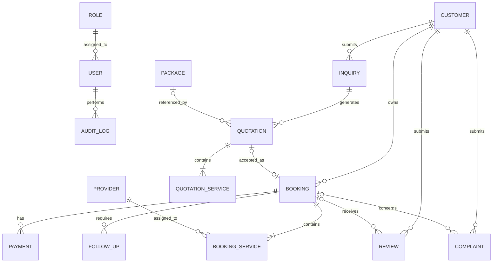

# AMX — Entity Relationship Diagram (ERD)

**File:** `docs/database/erd.md`
**Phase:** 6 — Database & API Design
**Status:** Draft for Validation

## 1. Purpose

Define the relationships between AMX database entities before specifying PostgreSQL tables, fields, keys, and constraints.

## 2. ERD

The following Mermaid diagram can be rendered directly in GitHub.

**Notation:** `||` = exactly one; `o|` = zero or one; `o{` = zero or many; `|{` = one or many.

## 3. Entity Relationship Rules

| Relationship                  | Rule                                                                                             |
| ----------------------------- | ------------------------------------------------------------------------------------------------ |
| Role → User                   | A role may be assigned to multiple users. Each user has one assigned role in the initial design. |
| User → Audit Log              | A user may perform many recorded actions.                                                        |
| Customer → Inquiry            | A customer may submit multiple inquiries.                                                        |
| Customer → Booking            | A customer may have multiple bookings.                                                           |
| Inquiry → Quotation           | An inquiry may generate multiple quotations or revisions.                                        |
| Package → Quotation           | A quotation may reference a package, or be custom-built without one.                             |
| Quotation → Quotation Service | Each quotation contains one or more proposed services.                                           |
| Quotation → Booking           | An accepted quotation may produce at most one booking.                                           |
| Booking → Booking Service     | Each booking contains one or more services.                                                      |
| Provider → Booking Service    | A provider may serve many booking services.                                                      |
| Booking → Payment             | A booking may have multiple payment records.                                                     |
| Booking → Follow-Up           | A booking may require multiple follow-up tasks.                                                  |
| Customer → Review             | A customer may submit multiple reviews.                                                          |
| Booking → Review              | A booking may receive feedback after completion.                                                 |
| Customer → Complaint          | A customer may submit multiple complaints.                                                       |
| Booking → Complaint           | A complaint may relate to a booking or be recorded without a linked booking when appropriate.    |

## 4. Important Design Decisions

### 4.1 Quotations and Bookings

* Preserve each quotation and its terms as historical records.
* A revised quotation should not silently overwrite a previously sent quotation.
* An accepted quotation may create one booking.
* Booking creation and quotation acceptance must be handled consistently by the backend, using a database transaction where appropriate.

### 4.2 Multiple Providers

A booking can include guides, drivers, hotels, boat services, or other providers.

`BOOKING_SERVICE` connects each booking to individual services and their assigned providers. This avoids restricting a booking to only one provider.

### 4.3 Payment Records

Each payment record belongs to a booking.

AMX records payment amount, date, method, reference, verification status, and related notes. Actual money transfer occurs outside AMX in the MVP.

### 4.4 Historical Accuracy

Changes to package prices or provider details must not silently rewrite the terms of existing quotations or confirmed bookings. Relevant service descriptions, prices, and agreed terms must be preserved in the detailed schema.

### 4.5 Reviews and Complaints

Reviews should be associated with completed trips where applicable. Complaints should preserve their status and resolution history. Detailed rules will be finalized in the entity and table specifications.

## 5. Supporting Entities

The following entities will also be included in the detailed design:

* `QUOTATION_SERVICE` — proposed services, descriptions, quantities, and prices.
* `BOOKING_SERVICE` — agreed services, assigned providers, service status, and agreed costs.
* `AUDIT_LOG` — actor, action, affected record, timestamp, and relevant change details.
* Additional supporting entities may be introduced if required to preserve service assignments, pricing history, or business rules.

## 6. Validation Checklist

* [x] Customers can have multiple inquiries and bookings.
* [x] Inquiries can produce revised quotations.
* [x] Quotations and bookings are separate entities.
* [x] Bookings support multiple services and providers.
* [x] Payments are linked to bookings.
* [x] User actions can be audited.
* [x] Custom quotations do not require a package.
* [ ] Detailed fields and constraints defined.
* [ ] All cardinalities validated against business rules.
* [ ] PostgreSQL implementation design approved.

**Current result:** Draft ERD prepared. Detailed schema validation remains.

## 7. Next Artifact

`docs/database/entity-specification.md` — define each entity's purpose, attributes, relationships, and business constraints before finalizing the table schema.
