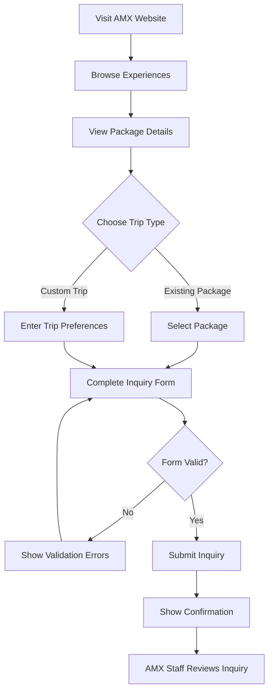
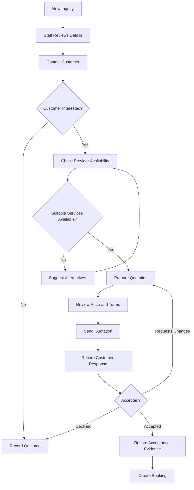
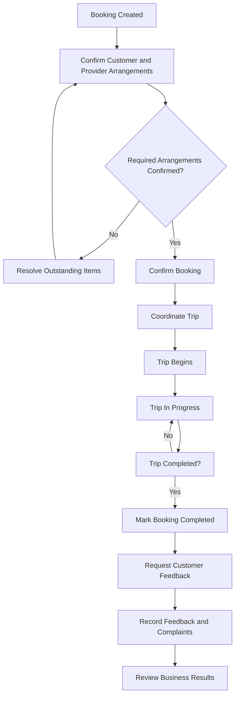
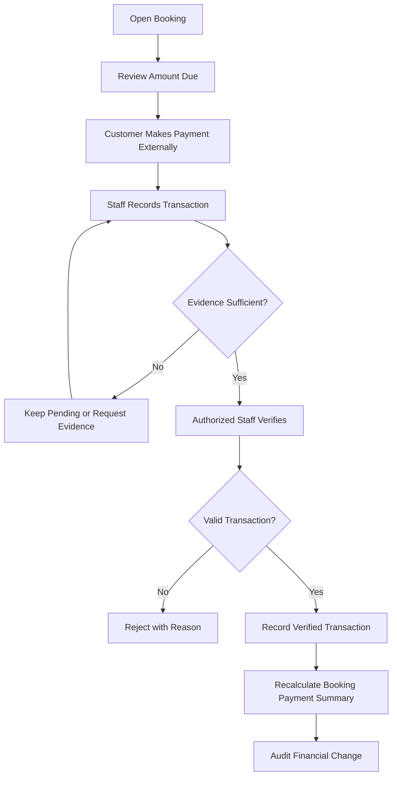
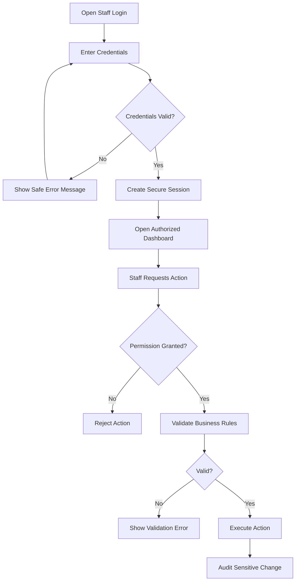

# AMX User Flow Diagrams

**Project:** AMX — Arba Minch Experiences
**Document:** `docs/ui-ux/user-flow-diagrams.md`
**Version:** 1.0
**Status:** Proposed — Pending Review

## 1. Purpose

Define the main interactions between visitors, customers, AMX staff, providers, and finance staff before designing individual screens.

## 2. Visitor Inquiry Flow

**Required UI states:** Empty form, validation errors, submission in progress, submission success, and submission failure with a retry option.

## 3. Inquiry-to-Quotation Flow

**Important rules:**

* Quotation revisions must remain traceable.
* Staff must not create duplicate bookings from the same quotation.
* Acceptance must be recorded before booking creation.
* A quotation must not be accepted if it is expired or otherwise ineligible.

## 4. Booking-to-Trip Completion Flow

**Important rules:**

* Booking status and individual service status must be tracked separately.
* The trip cannot be marked completed before it actually finishes.
* Cancellation and unexpected service failures require controlled workflows.
* Feedback collection must respect the approved review policy.

## 5. Payment Recording Flow

**Important rules:**

* AMX MVP records payments; it does not process online payments.
* Recording a transaction is not the same as verifying it.
* Only verified transactions affect payment summaries.
* Refunds are separate transactions linked to the original payment where applicable.
* Only authorized staff may verify financial transactions.

## 6. Staff Login and Permission Flow

**Important rules:**

* Permissions must be checked by the backend for every protected operation.
* Hiding a button is not sufficient authorization.
* Financial actions require the appropriate permissions.
* Session expiry, logout, and access denial must be handled clearly.

## 7. Main Screens Required by These Flows

| Flow            | Required Screens                                                                      |
| --------------- | ------------------------------------------------------------------------------------- |
| Visitor inquiry | Home, package listing, package details, custom-trip form, inquiry confirmation        |
| Quotation       | Inquiry list, inquiry details, customer details, quotation editor, quotation details  |
| Booking         | Booking list, booking details, service coordination, trip completion                  |
| Payments        | Booking financial summary, transaction form, transaction details, verification result |
| Authentication  | Login, dashboard, unauthorized-access message, session-expiry handling                |

## 8. Exceptions to Design

The wireframes must also cover:

* No packages available.
* Provider unavailable for requested dates.
* Invalid or incomplete inquiry.
* Duplicate submission.
* Expired quotation.
* Customer changes or cancellation request.
* Booking cancellation or provider failure.
* Rejected or disputed payment.
* Refund request.
* Unauthorized access.
* Network or server failure.

## 9. Validation Criteria

The flows are ready for approval when:

* Each main journey has a clear start and end.
* Decisions and failure paths are represented.
* Status changes agree with the requirements and database/API design.
* Every user action maps to a screen or component.
* Sensitive operations have explicit permission checks.
* Business-owner decisions are marked pending rather than assumed.

**Current status:** Proposed — pending stakeholder and cross-document review.

**Next file:** `docs/ui-ux/information-architecture.md`.
